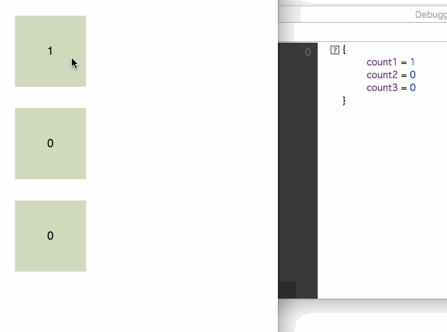

elm-visual-vdom (Proof of Concept)
----

[DEMO](https://jinjor.github.io/elm-visual-vdom/)

## What is this?

An experiment to show where in the View is acrually rendered by Model changes.
This is possible by some modification to Elm 0.18 debugger (elm-lang/virtual-dom).

## Where to go from here

Maybe it is also possible to show if `lazy` functions are correctly working or not.
This would help people to optimize rendering performance.
